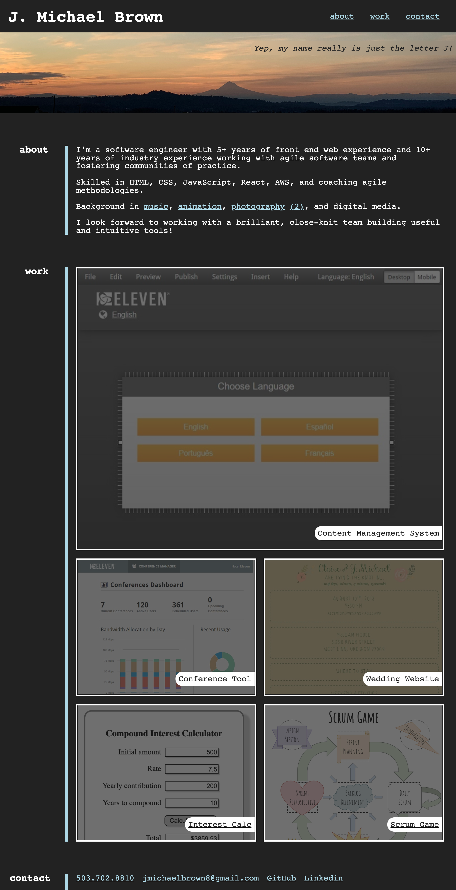
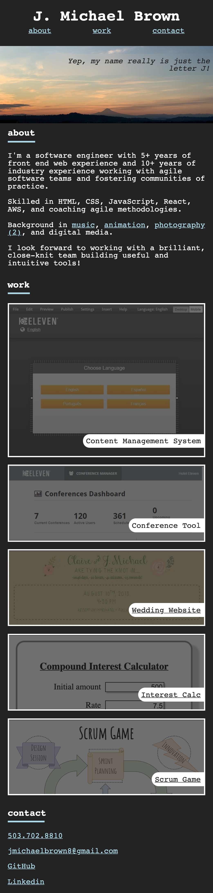

# 👨‍💻 portfolio

By J. Michael Brown

A simple static website to display some of my coding projects, some information about me, and my contact information. Thanks for taking a look!

## Technologies Used
* HTML
* CSS

## Description

This static website was built to display some of my coding projects and advertise my skillset. It is responsive to many screen sizes using flex and media queries.

## Setup

* Clone the repo
* Open index.html in your browser

## Deployment

This portfolio is deployed using GitHub pages at this link: [https://jmichaelbrown8.github.io/portfolio/](https://jmichaelbrown8.github.io/portfolio/)

### Desktop

### Mobile

## License

[MIT](./LICENSE)

Copyright (c) 2021 J. Michael Brown
